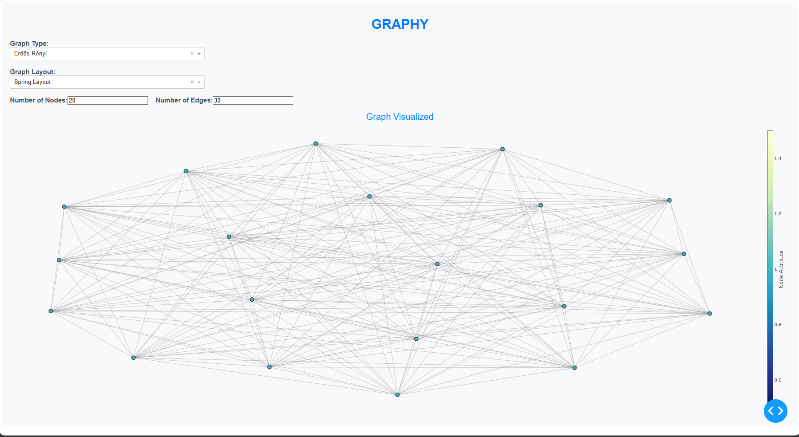
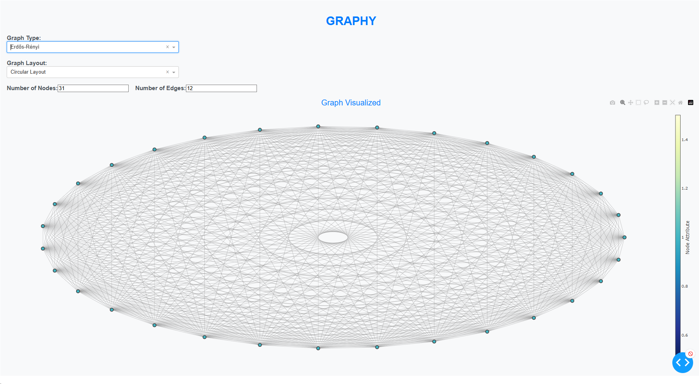
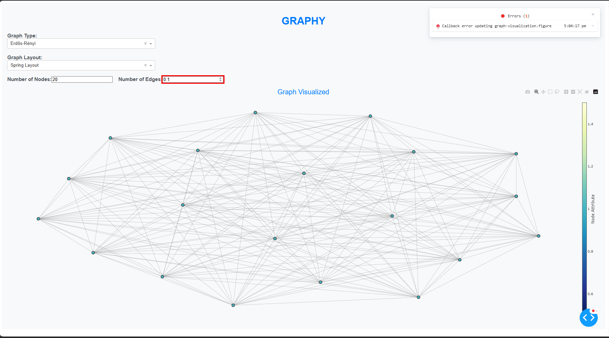
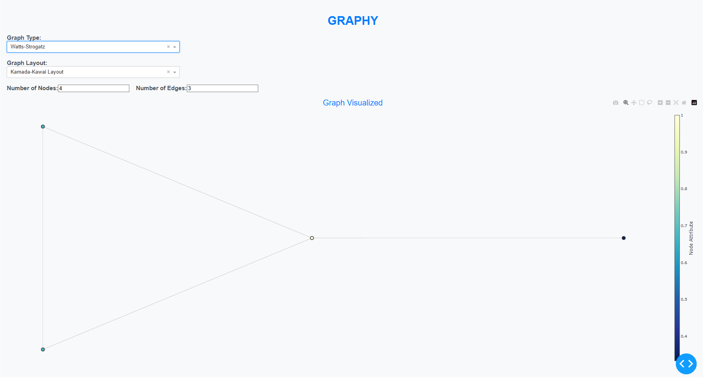
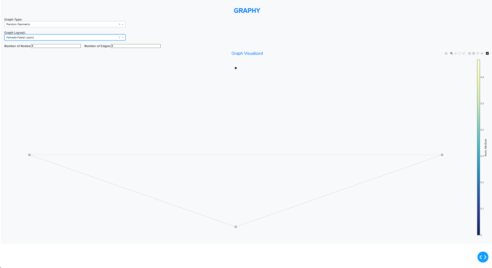
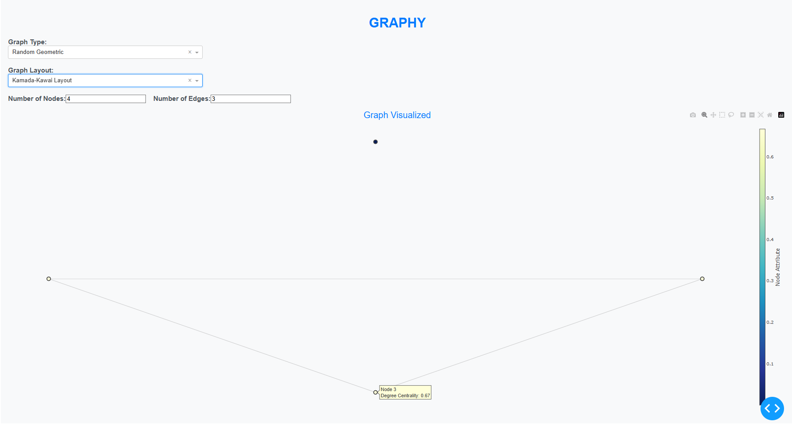
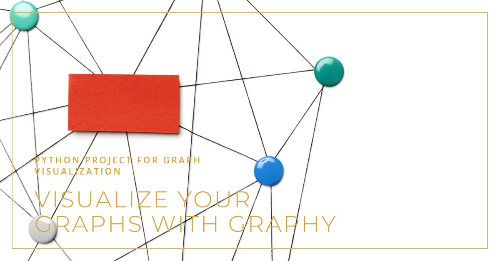

<p align="center" style="font-size: 55px;"><b>GRAPHY</b></p>
<p align="center">
  
</p>

## Overview
This project is a web application built with Dash and NetworkX that allows users to visualize random graphs using various graph generation algorithms. Users can interactively select the graph type, layout algorithm, number of nodes, and number of edges to generate and visualize the graph.

## Project Description
I created Graphy primarily out of curiosity about graph theory and its practical applications. The project aims to visualize various types of graphs using NetworkX, Dash, and Plotly. It's a simple yet effective tool for generating and exploring graphs like Erdős-Rényi, Barabási-Albert, and Watts-Strogatz networks.

Admittedly, the implementation is basic; it's a pretty lazy project with ample room for improvement. Nonetheless, Graphy serves as a practical exercise in applying graph theory concepts in a visual context. Future iterations may focus on enhancing the user interface, adding more graph types, and exploring advanced graph algorithms.


## Features
#### Graph Types Supported:

- Erdős-Rényi
- Barabási-Albert
- Watts-Strogatz
- Random Geometric
- Connected Caveman

#### Layout Algorithms:

- Spring Layout
- Circular Layout
- Random Layout
- Kamada-Kawai Layout
- Fruchterman-Reingold Layout

#### Interactive Controls:
- Dropdowns for selecting graph type and layout algorithm
- Input fields for specifying the number of nodes and edges

#### Graph Visualization:

- Nodes colored based on degree centrality
- Edge visualization with hover information


## Installation
1) Clone the repository:
   ```git clone https://github.com/RuntimeConnoisseurs/GRAPHY.git```
2) Navigate into the project directory:
3) Install the required Python packages:
    ```pip install -r requirements.txt```
    or run ```pip install networkx dash dash-core-components dash-html-components plotly```

## Running the Application
- Start the application by navigating into the project directory and running this command ```python app.py```

- Open a web browser and go to ```http://localhost:8050``` to view the application.

## Images
Default view once the webpage is launched:
<p align="center">
  
</p>
Another View with Circular Layout:
<p align="center">
  
</p>
When an error occur it is highhlighted and a pop-up is produced:
<p align="center">
  
</p>
Another Look with Watts-Strogatz Graph and Kamada Kawai Layout:
<p align="center">
  
</p>
A Random Geometric Graph:
<p align="center">
  
</p>
Hovering Over a Node shows its Degree Cardinality:
<p align="center">
  
</p>

Here is a demonstration of the project web page in action:
[](https://vimeo.com/976560392?share=copy)

## Function Modifications on "generate_random_graph"

1) Erdős-Rényi Graph (erdos_renyi):

- Parameters:
    - num_nodes: int - Number of nodes in the graph.
    - num_edges: float - Probability for edge creation. In NetworkX, this parameter represents the probability of an edge between any pair of nodes.
- Modification:
  - The function uses nx.erdos_renyi_graph(num_nodes, num_edges) where num_edges serves as the probability for edge creation.

2) Barabási-Albert Graph (barabasi_albert):

- Parameters:
    - num_nodes: int - Number of nodes in the graph.
    - num_edges: int - Number of edges to attach from a new node to existing nodes (m parameter).
- Modification:
    - Checks if num_edges is a float, converting it to int if necessary before creating the graph with nx.barabasi_albert_graph(num_nodes, num_edges).

3) Watts-Strogatz Graph (watts_strogatz):

- Parameters:
    - num_nodes: int - Number of nodes in the graph.
    - num_edges: int - Each node is joined with its k nearest neighbors in a ring topology (k parameter).
    - p: float - Probability of rewiring each edge (default set to 0.3).
- Modification:
  - Converts num_edges to int if it's a float before creating the graph with nx.watts_strogatz_graph(num_nodes, num_edges, p=0.3).

4) Random Geometric Graph (random_geometric):

- Parameters:
  - num_nodes: int or iterable - Number of nodes or iterable of nodes.
  - radius: float - Distance threshold value (default set to 0.3).
- Modification:
  - Creates the graph using nx.random_geometric_graph(num_nodes, radius=0.3), where radius determines the distance threshold for connecting nodes.

5) Connected Caveman Graph (connected_caveman):

- Parameters:
    - num_nodes: int - Number of nodes in the graph.
    - num_edges: int - Number of edges per clique (l * (k-1) where l is the number of cliques and k is the size of cliques).
- Modification:
    - Adjusts num_edges to an integer if it's a float, then calculates the number of edges per clique (num_edges // num_nodes) before creating the graph with nx.connected_caveman_graph(num_nodes, num_edges // num_nodes). 


> Users can manually access additional graph definitions in NetworkX by exploring the official documentation or specific graph types that require parameters not covered in this function. [Graph Generators Networkx](https://networkx.org/documentation/stable/reference/generators.html)

## Contributing
Contributions are welcome! If you have suggestions, feature requests, or bug reports, please open an issue or submit a pull request. 
**Please note that responses may be delayed as I am not always actively monitoring this repository.**

## Future Goals:
- Improving the UI/UX to make it more fluid.
- Add more Graph types and Graph layout, will need to have a deeper understanding of graph systems.
- Provide an example use cases ie., case studies.
- Allow for custom use input through files like GML,CSV,LEDA and others which would allow for custom graphs to be visualised.
- Proper Error Handling.


## License
This project is licensed under the MIT License - see the LICENSE file for details.


## Attributions
<a href="https://www.flaticon.com/free-icons/graph" title="graph icons">Graph icons created by Freepik - Flaticon</a>
